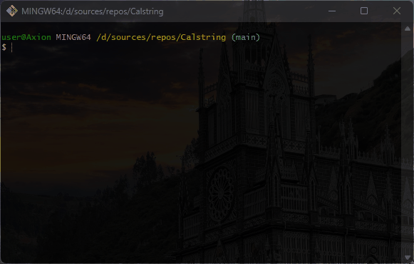

# 🧮 Calstring
Perform user-entered actions

### 💻 About program
*The program calculates mathematical operations of addition and subtraction involving optional operands.*

## 🪟 Preview

### ⚙️ Technologies
 

### 🧑‍💻 What I learned
- *working with while loop*
- *working with if else*
- *string methods*
- *char type*

### 🤝Future development
*You can improve performance by using the StringBuilder class instead of the string data type.*